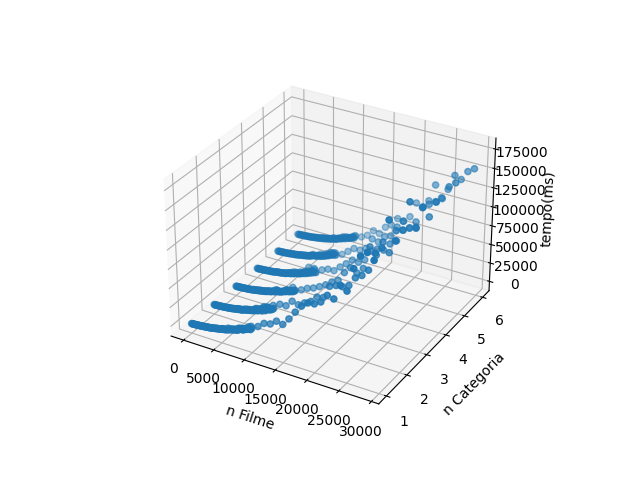
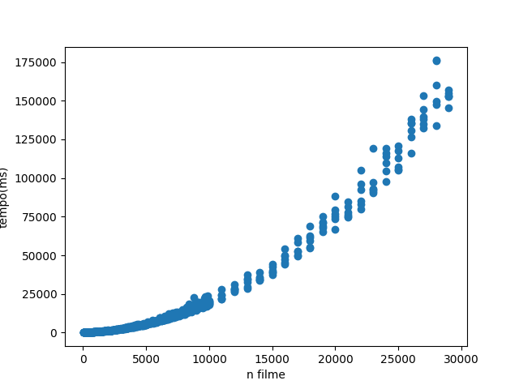

# Aleatoria

## Definição

Heurística aleatória é um algoritimo de busca que utiliza elementos aleatórios em seu processo de busca por soluções.

O algoritimo utiliza a aleatoriedade para explorar o espaço de busca de forma ampla e diversificada, em vez de se concentrar em um caminho específico. Isso permite que a heurística encontre soluções que podem ser menos óbvias que seriam ignoradas por outras mais determinísticas.

## Vantagens

- __Exploração ampla:__ explora o espaço de busca de forma ampla, maior as chances de encontrar soluções menos óbvias.
- __Flexibilidade:__ não segue uma estratégia determinística, é mais flexível em termos de adaptação podendo ser aplicada em uma ampla variedade de contextos.

## Desvantagens

- __Soluções sub-ótimas:__ A escolha aleatória de opções pode levar a soluções sub-ótimas.
- __Lentidão:__ Pode precisar avaliar um grande número de soluções antes de encontrar uma solução aceitável.

## Implementação

```cpp 
#include<iostream>
#include<iomanip>
#include<vector>
#include<fstream>
#include<algorithm>
#include<cstring>
#include<chrono>
#include <random>
#include<boost/random.hpp>

using namespace std;

struct filme{
    int inicio;
    int fim;
    int categoria;
    int duracao;
    int id;
};


bool ord_duracao(filme a, filme b);
bool ord_inicio(filme a, filme b);
void output(vector<filme> assistir);


int main(int argc, char *argv[]){

    ifstream inFile;
    string fileName = argv[1]; 
    int n;
    int nCat;
    int cat;

    vector<int> categorias;
    vector<bool> agenda;
    vector<filme> filmes;
    vector<filme> assistir;
    vector<filme> melhor;
    vector<filme> tmp;
    assistir.reserve(24);

    default_random_engine generator (10);
    uniform_real_distribution<double> distribution(0.0, 1.0);

    inFile.open("inputs/" + fileName + ".txt");
    if (!inFile) {
        cout << "Unable to open file";
        exit(1); // terminate with error
    }

    inFile >> n;
    inFile >> nCat;

    for (int i = 0; i < nCat; i++){
        inFile >> cat;
        categorias.push_back(cat);
    }

    for (int i = 0; i < 24; i++){
        agenda.push_back(true);
    }

    for(int i = 0; i < n; i++){
        filme k;
        int inicio, fim, categoria;
        inFile >> inicio;
        inFile >> fim;
        inFile >> categoria;
        if(fim > inicio){
            k.fim = fim;
            k.inicio = inicio;
            k.duracao = k.fim - k.inicio;
            k.categoria = categoria;
            k.id = i + 3;
            filmes.push_back(k);
        }        
    }

    bool disponivel = true;
    int maratona = 0;
    size_t maxFilmes = 0;
    sort(filmes.begin(), filmes.end(), ord_duracao);
    
    chrono::steady_clock::time_point start = chrono::steady_clock::now();
    sort(filmes.begin(), filmes.end(), ord_inicio);
    tmp = filmes;

    for (int t = 0; t < 10; t++){    
        filmes = tmp;
        assistir.clear();
        for (size_t i = 0; i < filmes.size(); i++){
            disponivel = all_of(agenda.begin() + filmes[i].inicio, agenda.begin() + filmes[i].fim, [](bool b){ return b == true; });
            if (categorias[filmes[i].categoria - 1] <= 0){
                disponivel = false;
            }
            if (disponivel){
                int categoria_index = filmes[i].categoria - 1;
                for (int k = filmes[i].inicio; k < filmes[i].fim; k++){
                    agenda[k] = false;
                }
                assistir.push_back(filmes[i]);
                maratona += filmes[i].duracao;
                categorias[categoria_index] -= 1; 
            }  
            disponivel = true; 

            if(distribution(generator) < 0.25){
                uniform_int_distribution<int> distribution(i, filmes.size()-1);
                int p = distribution(generator);
                disponivel = all_of(agenda.begin() + filmes[p].inicio, agenda.begin() + filmes[p].fim, [](bool b){ return b == true; });
                if (categorias[filmes[p].categoria - 1] <= 0){
                    disponivel = false;
                }
                if (disponivel){
                    int categoria_index = filmes[p].categoria - 1;
                    for (int k = filmes[p].inicio; k < filmes[p].fim; k++){
                        agenda[k] = false;
                    }
                    assistir.push_back(filmes[p]);
                    maratona += filmes[p].duracao;
                    categorias[categoria_index] -= 1; 
                }  
                filmes.erase(filmes.begin() + p);
                disponivel = true; 
            }

        }
        if(maxFilmes < assistir.size()){
            maxFilmes = assistir.size();
            melhor = assistir;
        }
        for (int i = 0; i < 24; i++){
            agenda[i] = true;
        }
    }
    chrono::steady_clock::time_point end = chrono::steady_clock::now();

    cout << n << ' ' << nCat << ' ' << chrono::duration_cast<chrono::microseconds>(end-start).count() << ' ' << melhor.size() << endl;

    if(argc > 2 && strcmp(argv[2], "-output") == 0){ 
        cout << "Quantidade de filmes:" << melhor.size() << endl;
        //cout << "Tempo para assistir:" << maratona << endl;

        sort(melhor.begin(), melhor.end(), ord_inicio);

        output(melhor);
    }

    ofstream outFile;
    outFile.open("outputs/aleatorio/out_" + to_string(n) + "_" + to_string(nCat) + ".txt");
    if (!outFile) {
        cout << "Unable to open file";
        exit(1); // terminate with error
    }

    outFile <<  n << ' ' << nCat << ' ' << chrono::duration_cast<chrono::microseconds>(end-start).count() << ' ' << assistir.size() << endl;

    return 0;
}

bool ord_duracao(filme a, filme b){
    return a.duracao < b.duracao;
}

bool ord_inicio(filme a, filme b){
    return a.inicio < b.inicio;
}

void output(vector<filme> assistir){
    for (int i = 0; i < 24; i++){
        cout << setfill('0') << setw(2) << i; 
        cout << " - ";
    }

    cout << endl;
    
    for (size_t i = 0; i < assistir.size(); i++){
        for (int j = 0; j < assistir[i].inicio; j++){
           cout << "     ";
        }
        
        //cout << assistir[i].inicio;
        if(assistir[i].categoria == 1){
            cout << "\033[1;31m";//vermelho
        }
        else if(assistir[i].categoria == 2){
            cout << "\033[1;32m";//verde
        }
        else if(assistir[i].categoria == 3){
            cout << "\033[1;33m";//azul
        }
        else if(assistir[i].categoria == 4){
            cout << "\033[1;34m";//amarelo
        }
        else if(assistir[i].categoria == 5){
            cout << "\033[1;35m";
        }
        else{
            cout << "\033[1;36m";
        }
        for(int j = 0; j < assistir[i].duracao; j++){
            cout << "\u25A0";
            cout << "\u25A0";
            cout << "\u25A0";
        }
        for(int j = 0; j < assistir[i].duracao + 1; j++){
            cout << "\u25A0";
            cout << "\u25A0";
        }
        cout << endl;
    }

}
```

## Desempenho

```
--------------------------------------------------------------------------------
-- User-annotated source: projetoAleatorio.cpp
--------------------------------------------------------------------------------
Ir      

-- line 19 ----------------------------------------
      .  };
      .  
      .  
      .  bool ord_duracao(filme a, filme b);
      .  bool ord_inicio(filme a, filme b);
      .  void output(vector<filme> assistir);
      .  
      .  
     14  int main(int argc, char *argv[]){
      .  
      5      ifstream inFile;
  6,210  => ???:0x000000000010a390 (1x)
    778  => ???:0x000000000010a270 (1x)
      1      string fileName = argv[1]; 
      .      int n;
      .      int nCat;
      .      int cat;
      .  
      .      vector<int> categorias;
      .      vector<bool> agenda;
      .      vector<filme> filmes;
      .      vector<filme> assistir;
      .      vector<filme> melhor;
      .      vector<filme> tmp;
      .      assistir.reserve(24);
      .  
      .      default_random_engine generator (10);
      .      uniform_real_distribution<double> distribution(0.0, 1.0);
      .  
     11      inFile.open("inputs/" + fileName + ".txt");
  6,651  => ???:0x000000000010a330 (1x)
    101  => /usr/include/c++/9/bits/basic_string.h:std::__cxx11::basic_string<char, std::char_traits<char>, std::allocator<char> > std::operator+<char, std::char_traits<char>, std::allocator<char> >(std::__cxx11::basic_string<char, std::char_traits<char>, std::allocator<char> >&&, char const*) (1x)
      2      if (!inFile) {
      .          cout << "Unable to open file";
      .          exit(1); // terminate with error
      .      }
      .  
      3      inFile >> n;
  6,007  => ???:0x000000000010a2e0 (1x)
      3      inFile >> nCat;
    405  => ???:0x000000000010a2e0 (1x)
      .  
     22      for (int i = 0; i < nCat; i++){
     15          inFile >> cat;
  2,187  => ???:0x000000000010a2e0 (5x)
      .          categorias.push_back(cat);
      .      }
      .  
     48      for (int i = 0; i < 24; i++){
      .          agenda.push_back(true);
      .      }
      .  
 56,030      for(int i = 0; i < n; i++){
      .          filme k;
      .          int inicio, fim, categoria;
 30,000          inFile >> inicio;
4,362,922  => ???:0x000000000010a2e0 (10,000x)
 30,001          inFile >> fim;
4,361,274  => ???:0x000000000010a2e0 (10,000x)
 30,000          inFile >> categoria;
4,050,376  => ???:0x000000000010a2e0 (10,000x)
 40,000          if(fim > inicio){
  8,690              k.fim = fim;
  8,690              k.inicio = inicio;
 17,380              k.duracao = k.fim - k.inicio;
 17,380              k.categoria = categoria;
 17,380              k.id = i + 3;
      .              filmes.push_back(k);
      .          }        
      .      }
      .  
      .      bool disponivel = true;
      .      int maratona = 0;
      2      size_t maxFilmes = 0;
      .      sort(filmes.begin(), filmes.end(), ord_duracao);
      .      
      2      chrono::steady_clock::time_point start = chrono::steady_clock::now();
    937  => ???:0x000000000010a3e0 (1x)
      .      sort(filmes.begin(), filmes.end(), ord_inicio);
      7      tmp = filmes;
174,165  => /usr/include/c++/9/bits/vector.tcc:std::vector<filme, std::allocator<filme> >::operator=(std::vector<filme, std::allocator<filme> > const&) (1x)
      .  
     30      for (int t = 0; t < 10; t++){    
     30          filmes = tmp;
1,738,978  => /usr/include/c++/9/bits/vector.tcc:std::vector<filme, std::allocator<filme> >::operator=(std::vector<filme, std::allocator<filme> > const&) (10x)
      .          assistir.clear();
225,917          for (size_t i = 0; i < filmes.size(); i++){
277,928              disponivel = all_of(agenda.begin() + filmes[i].inicio, agenda.begin() + filmes[i].fim, [](bool b){ return b == true; });
194,582              if (categorias[filmes[i].categoria - 1] <= 0){
      .                  disponivel = false;
      .              }
      .              if (disponivel){
      .                  int categoria_index = filmes[i].categoria - 1;
    114                  for (int k = filmes[i].inicio; k < filmes[i].fim; k++){
     10                      agenda[k] = false;
      .                  }
      .                  assistir.push_back(filmes[i]);
      .                  maratona += filmes[i].duracao;
     20                  categorias[categoria_index] -= 1; 
      .              }  
      .              disponivel = true; 
      .  
208,446              if(distribution(generator) < 0.25){
 52,263                  uniform_int_distribution<int> distribution(i, filmes.size()-1);
      .                  int p = distribution(generator);
 69,684                  disponivel = all_of(agenda.begin() + filmes[p].inicio, agenda.begin() + filmes[p].fim, [](bool b){ return b == true; });
 50,031                  if (categorias[filmes[p].categoria - 1] <= 0){
      .                      disponivel = false;
      .                  }
      .                  if (disponivel){
      .                      int categoria_index = filmes[p].categoria - 1;
    670                      for (int k = filmes[p].inicio; k < filmes[p].fim; k++){
     65                          agenda[k] = false;
      .                      }
      .                      assistir.push_back(filmes[p]);
      .                      maratona += filmes[p].duracao;
    130                      categorias[categoria_index] -= 1; 
      .                  }  
      .                  filmes.erase(filmes.begin() + p);
 52,263                  disponivel = true; 
      .              }
      .  
      .          }
     20          if(maxFilmes < assistir.size()){
      .              maxFilmes = assistir.size();
     12              melhor = assistir;
  1,312  => /usr/include/c++/9/bits/vector.tcc:std::vector<filme, std::allocator<filme> >::operator=(std::vector<filme, std::allocator<filme> > const&) (3x)
      .          }
    730          for (int i = 0; i < 24; i++){
     10              agenda[i] = true;
      .          }
      .      }
      2      chrono::steady_clock::time_point end = chrono::steady_clock::now();
     40  => ???:0x000000000010a3e0 (1x)
      .  
      7      cout << n << ' ' << nCat << ' ' << chrono::duration_cast<chrono::microseconds>(end-start).count() << ' ' << melhor.size() << endl;
  7,812  => ???:0x000000000010a450 (2x)
      .  
     19      if(argc > 2 && strcmp(argv[2], "-output") == 0){ 
      .          cout << "Quantidade de filmes:" << melhor.size() << endl;
      .          //cout << "Tempo para assistir:" << maratona << endl;
      .  
      .          sort(melhor.begin(), melhor.end(), ord_inicio);
      .  
      2          output(melhor);
 99,700  => projetoAleatorio.cpp:output(std::vector<filme, std::allocator<filme> >) (1x)
      .      }
      .  
      4      ofstream outFile;
  8,665  => ???:0x000000000010a3f0 (1x)
  2,424  => ???:0x000000000010a440 (1x)
     13      outFile.open("outputs/aleatorio/out_" + to_string(n) + "_" + to_string(nCat) + ".txt");
  1,163  => /usr/include/c++/9/bits/basic_string.h:std::__cxx11::basic_string<char, std::char_traits<char>, std::allocator<char> > std::operator+<char, std::char_traits<char>, std::allocator<char> >(std::__cxx11::basic_string<char, std::char_traits<char>, std::allocator<char> >&&, char const*) (2x)
    935  => ???:0x000000000010a2b0 (1x)
      2      if (!outFile) {
      .          cout << "Unable to open file";
      .          exit(1); // terminate with error
      .      }
      .  
      8      outFile <<  n << ' ' << nCat << ' ' << chrono::duration_cast<chrono::microseconds>(end-start).count() << ' ' << assistir.size() << endl;
  1,817  => ???:0x000000000010a450 (2x)
      .  
      .      return 0;
     12  }
      .  
 96,849  bool ord_duracao(filme a, filme b){
290,547      return a.duracao < b.duracao;
 96,849  }
      .  
101,079  bool ord_inicio(filme a, filme b){
303,237      return a.inicio < b.inicio;
101,079  }
      .  
     12  void output(vector<filme> assistir){
     73      for (int i = 0; i < 24; i++){
     72          cout << setfill('0') << setw(2) << i; 
 13,410  => ???:0x000000000010a450 (24x)
      .          cout << " - ";
      .      }
      .  
      .      cout << endl;
      .      
     70      for (size_t i = 0; i < assistir.size(); i++){
    459          for (int j = 0; j < assistir[i].inicio; j++){
      .             cout << "     ";
      .          }
      .          
      .          //cout << assistir[i].inicio;
     39          if(assistir[i].categoria == 1){
      .              cout << "\033[1;31m";//vermelho
      .          }
     24          else if(assistir[i].categoria == 2){
      .              cout << "\033[1;32m";//verde
      .          }
     16          else if(assistir[i].categoria == 3){
      .              cout << "\033[1;33m";//azul
      .          }
      6          else if(assistir[i].categoria == 4){
      .              cout << "\033[1;34m";//amarelo
      .          }
      .          else if(assistir[i].categoria == 5){
      .              cout << "\033[1;35m";
      .          }
      .          else{
      .              cout << "\033[1;36m";
      .          }
    193          for(int j = 0; j < assistir[i].duracao; j++){
      .              cout << "\u25A0";
      .              cout << "\u25A0";
      .              cout << "\u25A0";
      .          }
    196          for(int j = 0; j < assistir[i].duracao + 1; j++){
      .              cout << "\u25A0";
      .              cout << "\u25A0";
      .          }
      .          cout << endl;
      .      }
      .  
     11  }
--------------------------------------------------------------------------------
Ir        
--------------------------------------------------------------------------------
2,379,521  events annotated
```

## Resultados

  

> Representação geral da performace

  
